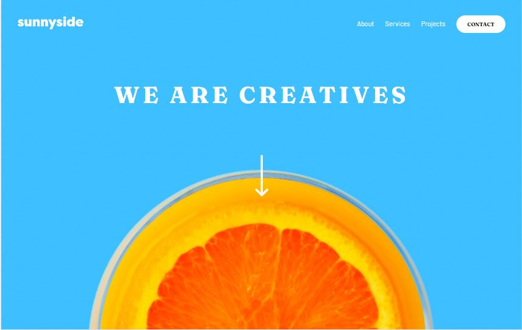

# Frontend Mentor - Sunnyside agency landing page solution

This is a solution to the [Sunnyside agency landing page challenge on Frontend Mentor](https://www.frontendmentor.io/challenges/sunnyside-agency-landing-page-7yVs3B6ef). Frontend Mentor challenges help you improve your coding skills by building realistic projects.

## Table of contents

- [Overview](#overview)
  - [The challenge](#the-challenge)
  - [Screenshot](#screenshot)
  - [Links](#links)
- [My process](#my-process)
  - [Built with](#built-with)
  - [What I learned](#what-i-learned)
- [Author](#author)
- [Acknowledgments](#acknowledgments)

## Overview

### The challenge

Users should be able to:

- View the optimal layout for the site depending on their device's screen size
- See hover states for all interactive elements on the page

### Screenshot



### Links

- Solution URL: [Add solution URL here](https://your-solution-url.com)
- Live Site URL: [Add live site URL here](https://your-live-site-url.com)

## My process

### Built with

- Semantic HTML5 markup
- CSS custom properties
- Flexbox
- CSS Grid
- SASS
- Mobile-first workflow
- [JQuery](https://jquery.com/) - JS library

**Note: These are just examples. Delete this note and replace the list above with your own choices**

### What I learned

```css
@mixin mobile {
  @media (max-width: 375px) {
    @content;
  }
}
```

```js
$(document).ready(function () {
  const hamburger = $('.hamburger');
  const menu = $('header .nav .nav__menu');

  hamburger.click(function () {
    menu.slideToggle('400');
    menu.toggleClass('show');
  });
});
```

## Author

- Frontend Mentor - [@mochkholil](https://www.frontendmentor.io/profile/mochkholil)
- Twitter - [@SelaluBahagi4](https://www.twitter.com/SelaluBahagi4)

## Acknowledgments

I've learn a lot from youtube, medium, and many website. Proud of the creator who give a tutorial that make everyone build a website.
